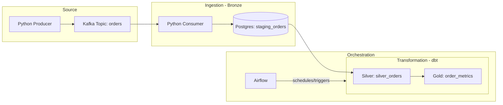

# Real-Time Order Data Pipeline (Medallion Architecture)

This project demonstrates a modern data engineering pipeline for processing real-time order events using a Medallion Architecture (Bronze, Silver, Gold).

The system simulates order events, streams them through Kafka, stores them in PostgreSQL (Bronze), and transforms them using dbt (Silver/Gold) via Airflow orchestration to produce analytics-ready datasets.

---

## Architecture Diagram



---

## Tech Stack

* Python
* Apache Kafka (KRaft mode)
* PostgreSQL
* Apache Airflow
* dbt
* Docker

Main technologies used:

* Apache Kafka – real-time streaming platform
* PostgreSQL – relational database for staging data
* Apache Airflow – workflow orchestration and scheduling
* dbt – data transformation and analytics modeling

---

## Features

* Real-time streaming pipeline
* Kafka producer generating simulated order events
* Kafka consumer ingesting events into PostgreSQL
* Automatic table creation in the consumer
* Airflow DAG aggregating order metrics
* dbt models for analytics transformations
* Fully containerized environment using Docker

---

## Project Structure

```
streaming-order-pipeline/
├── producer/
│   └── order_producer.py      # Simulates real-time JSON orders
├── consumer/
│   └── order_consumer.py      # Ingests Kafka messages into Postgres (Bronze)
├── dags/
│   └── order_aggregation.py   # Airflow DAG orchestrating dbt runs
├── dbt_project/
│   └── streaming_orders/      # dbt project directory
│       ├── models/
│       │   ├── 2_silver/      # Cleaned and typed order data
│       │   └── 3_gold/        # Aggregated business metrics
│       └── dbt_project.yml
├── docker-compose.yml         # Container definitions
└── README.md
```

---

## How the Pipeline Works

1. **Order Producer**

   * Python script generates simulated order events.

2. **Streaming Layer**

   * Orders are published to a Kafka topic (`orders`).

3. **Consumer Service**

   * A Kafka consumer reads events and inserts them into the Bronze table (staging_orders).

4. **Data Transformation**

   * Silver Layer: dbt cleans, casts, and deduplicates raw orders.
   * Gold Layer: dbt aggregates the Silver data into business metrics.

5. **Workflow Orchestration**
   * Airflow triggers the dbt transformations, ensuring the analytics layer is always up to date..
---

## Run the Project

### 1️⃣ Start Infrastructure & Set Permissions

```bash
chmod -R 777 ~/streaming-order-pipeline
docker compose up -d --build
```

This starts:

* Kafka
* PostgreSQL
* Airflow

---

### 2️⃣ Run the Kafka Producer

```bash
python producer/order_producer.py
```

This generates simulated order events.

---

### 3️⃣ Run the Kafka Consumer

```bash
python consumer/order_consumer.py
```

The consumer:

* Reads messages from Kafka
* Inserts them into PostgreSQL

---

### 4️⃣ Run dbt 

```bash
docker exec -it airflow-scheduler /bin/bash -c "cd /opt/airflow/dbt_project/streaming_orders && /home/airflow/.local/bin/dbt run --profiles-dir /opt/airflow/.dbt"
```

To verify the connection and build the initial Silver/Gold tables, run dbt through the Airflow container:

---

### 5️⃣ Open Airflow

```
http://localhost:8082
```

Login with default credentials: `admin` / `admin`

---

## Example Output (Gold Layer)

Aggregated business metrics from public.order_metrics:

| total_orders | total_revenue | avg_order_value | last_updated |
| ------------ | ------------- | --------------- | ------------ |
| 281          | 14250.50      | 50.71           | 2026-04-05   |

---

## Learning Goals

This project demonstrates practical experience with:

* Building end-to-end streaming pipelines.
* Developing production-style Medallion Architectures.
* Orchestrating dbt models within an Airflow ecosystem.
* Transforming data using dbt

---

## Author

**Seyfemichael Araya**

Data Engineering | Data Science | Analytics

