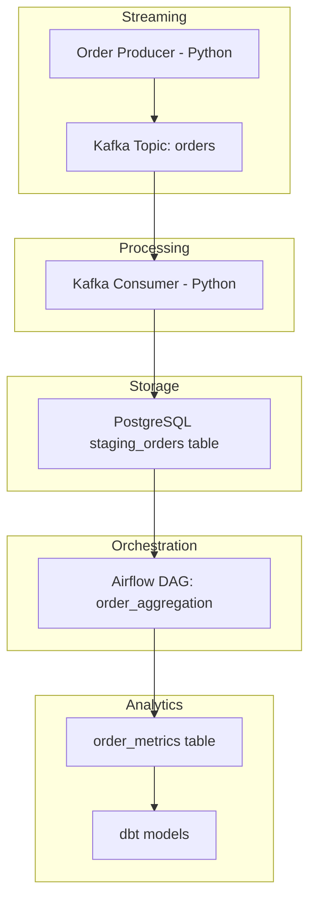

# Real-Time Order Data Pipeline

This project demonstrates a **modern data engineering pipeline** for processing real-time order events using streaming technologies and workflow orchestration.

The system simulates order events, streams them through Kafka, stores them in PostgreSQL, and aggregates them using Airflow and dbt to produce analytics-ready datasets.

The goal of this project is to showcase a **production-style data pipeline architecture** including streaming ingestion, data storage, orchestration, and transformation.

---

## Architecture Diagram



---

## Tech Stack

* Python
* Apache Kafka (KRaft mode)
* PostgreSQL
* Apache Airflow
* dbt
* Docker

Main technologies used:

* Apache Kafka – real-time streaming platform
* PostgreSQL – relational database for staging data
* Apache Airflow – workflow orchestration and scheduling
* dbt – data transformation and analytics modeling

---

## Features

* Real-time streaming pipeline
* Kafka producer generating simulated order events
* Kafka consumer ingesting events into PostgreSQL
* Automatic table creation in the consumer
* Airflow DAG aggregating order metrics
* dbt models for analytics transformations
* Fully containerized environment using Docker

---

## Project Structure

```
streaming-order-pipeline
│
├── producer/
│   └── order_producer.py
│
├── consumer/
│   └── order_consumer.py
│
├── airflow/
│   └── dags/
│       └── order_aggregation.py
│
├── dbt_project/
│   └── models/
│       └── order_metrics.sql
│
├── docker-compose.yml
└── README.md
```

---

## How the Pipeline Works

1. **Order Producer**

   * Python script generates simulated order events.

2. **Streaming Layer**

   * Orders are published to a Kafka topic (`orders`).

3. **Consumer Service**

   * A Kafka consumer reads the events and inserts them into PostgreSQL.

4. **Staging Layer**

   * Orders are stored in the `staging_orders` table.

5. **Workflow Orchestration**

   * Airflow runs a DAG that aggregates orders.

6. **Analytics Layer**

   * dbt transforms the data into analytics-ready tables.

---

## Run the Project

### 1️⃣ Start Infrastructure

```bash
docker compose up -d
```

This starts:

* Kafka
* PostgreSQL
* Airflow

---

### 2️⃣ Run the Kafka Producer

```bash
python producer/order_producer.py
```

This generates simulated order events.

---

### 3️⃣ Run the Kafka Consumer

```bash
python consumer/order_consumer.py
```

The consumer:

* Reads messages from Kafka
* Inserts them into PostgreSQL

---

### 4️⃣ Open Airflow

```
http://localhost:8082
```

Login with the default Airflow credentials.

---

### 5️⃣ Trigger the DAG

Run the DAG:

```
order_aggregation
```

This aggregates order data into analytics tables.

---

## Example Output

Daily aggregated metrics:

| order_date | total_orders | revenue   |
| ---------- | ------------ | --------- |
| 2026-03-11 | 145          | 15234.50  |
| 2026-03-10 | 995          | 107435.16 |
| 2026-03-09 | 396          | 42073.90  |

---

## Learning Goals

This project demonstrates practical experience with:

* Building streaming pipelines
* Working with Kafka producers and consumers
* Designing staging and analytics layers
* Orchestrating workflows using Airflow
* Transforming data using dbt
* Managing infrastructure with Docker

---

## Author

**Seyfemichael Araya**

Data Engineering | Data Science | Analytics

